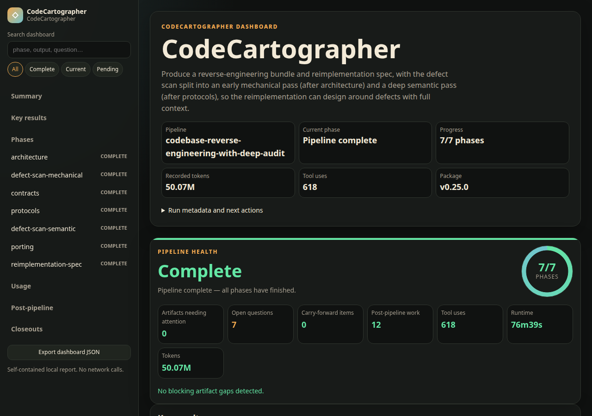

<p align="center">
  
</p>

# CodeCartographer

[](https://github.com/HuginnIndustries/CodeCartographer/actions/workflows/ci.yml)
[](LICENSE)
[](https://www.npmjs.com/package/codecartographer-pi)
[](package.json)

> **Understand an unfamiliar codebase with an AI agent — and get a validated spec you can rebuild from.** CodeCartographer turns a repository into layered architecture, behavioral contracts, defect findings, and a language-agnostic reimplementation spec, with each phase validated before the next one runs. Works with Pi, Claude Code, Cursor, Codex, or any MCP-capable agent.

```text
●  CodeCartographer
├─ ✓  architecture phase    ⟳ 25 · 76 tool uses · 1.0M tokens · 4m28s
├─ ✓  defect-scan-mech.     ⟳ 39 · 91 tool uses · 2.4M tokens · 7m05s
└─ ⠹  contracts phase       ⟳ 11 · 37 tool uses · 335.1k tokens · 40.1s
       ⎿ extracting behavioral contracts from server/index.ts…
```

<p align="center">
  
</p>

---

## Why CodeCartographer

Asking an LLM to "analyze this repo" loses context halfway through, hallucinates findings, and leaves no artifact the next session can pick up. CodeCartographer fixes three things:

1. **The filesystem is the memory, not the conversation.** Each phase writes a smaller, templated, evidence-tagged artifact to `.codecarto/findings/`. Later phases re-read the specific upstream files they need. A new session — or a context compaction — picks up from `status.yaml` without losing progress.

2. **Every phase is validated before the pipeline advances.** Completion criteria are real: a `FAIL` output stops the run. You can't accidentally build a reimplementation spec on top of hallucinated architecture.

3. **The output is a spec, not a chat log.** The final `reimplementation-spec.md` is language-agnostic, module-inventoried, and carries acceptance scenarios plus known unknowns. Hand it to another agent to rebuild from.

Every finding is tagged with an evidence level: `observed fact`, `strong inference`, `portability hazard`, or `open question`.

---

## At a glance

| What you get | Where it lives |
|---|---|
| **Layered analysis pipeline** — architecture → defect scan → behavioral contracts → protocols → porting → reimplementation spec | `.codecarto/` template |
| **Validation gates between phases** — no advancing past a `FAIL` output | `core/` state machine |
| **Three surfaces, one framework** — Pi extension (recommended), MCP server (for other coding agents), or drop-in template (one-off / evaluation) | All three share `core/` |
| **Live progress widget** while phase sub-agents work | Pi extension |
| **HTML dashboard** — single-file aggregate of progress, links, usage, narrative | `.codecarto/dashboard.html` |
| **Per-phase token tracking** | `/codecarto-usage` |
| **Opt-in LLM steering** of the next phase's seed prompt | `/codecarto-next --llm-steer` |
| **Forward synthesis** — vision + confirmed library specs → provenance-backed project plan | `pipeline-synthesis.yaml` |

Publish completed reimplementation specs from Pi or MCP, then run the `synthesis` pipeline to turn a product vision and explicitly confirmed library entries into a conflict-aware `project-plan.md` with a decision-level provenance ledger.

> **If CodeCartographer saves you a day of codebase archaeology, star the repo** — it helps the next person find it.

OpenAI Build Week reviewers: see the [new-vs-existing scope and one-command demo](docs/build-week-2026.md).

---

## Install

Three surfaces, in recommended order. All three share the same `core/` and produce byte-identical phase prompts. Pi provides the richest orchestration UX; Pi and MCP both support the executable library and synthesis workflows; drop-in mode provides the analysis framework without those runtime operations.

1. **Pi extension** — recommended for interactive use. First-class UX.
2. **MCP server** — for Claude Code, Codex, opencode, Cursor, Claude Desktop, and any other MCP-capable agent.
3. **Drop-in template** — pure `.codecarto/` markdown + YAML for one-off evaluation or any LLM that can read and write files. Library and synthesis workflows are **not** available in pure drop-in mode; the analysis side works fully.

### Pi extension (recommended)

[Pi](https://github.com/badlogic/pi-mono/tree/main/packages/coding-agent) is a TUI coding agent. The CodeCartographer extension adds slash commands, a live agents widget, and the dashboard.

```bash
pi install npm:codecartographer-pi          # from the npm registry
pi install /absolute/path/to/CodeCartographer  # from a local checkout
pi install git:github.com/HuginnIndustries/CodeCartographer  # from a git URL
```

> **Don't** run `npm install codecartographer-pi` for the Pi use case. Plain `npm install` puts the package on disk but doesn't register it with Pi. Use `pi install npm:...` so Pi writes the package into its own `~/.pi/agent/settings.json`.

For extension development, point Pi directly at the entrypoint:

```bash
pi -e /absolute/path/to/CodeCartographer/extensions/codecarto/index.ts
```

### MCP server (for other coding agents)

Use this when your coding agent isn't Pi — Claude Code, Codex, opencode, Cursor, Claude Desktop, or anything else that speaks MCP. The host drives the conversation and runs the LLM; CodeCartographer provides phase prompts, validation, and experimental library publish/list/reindex operations.

> **30-second setup for Claude Code, Cursor, Codex, and Claude Desktop: see the [MCP quickstart](docs/mcp-quickstart.md).**

> **Teaching an agent to drive it:** call the `codecarto_guide` tool — the server returns the full drive loop, the phase-handoff contract, executor selection, and recovery patterns, with nothing to install. The same content ships as an installable skill at `agent-skill/codecartographer/` for agents that load skills from disk.

```bash
npm install --global codecartographer-pi
```

Add to your host config (`~/.config/claude-code/config.json`, `claude_desktop_config.json`, etc.):

```json
{
  "mcpServers": {
    "codecartographer": {
      "command": "codecarto-mcp"
    }
  }
}
```

[Official MCP Registry listing](https://registry.modelcontextprotocol.io/?search=CodeCartographer): `io.github.HuginnIndustries/codecartographer`.

### Drop-in template (one-off / evaluation)

Use this to try CodeCartographer in any repo without installing anything, or in environments where neither Pi nor an MCP-capable agent is available. Works with any LLM that can read and write files.

```bash
cp -r /path/to/CodeCartographer/.codecarto /path/to/your-repo/
```

Then in the LLM session: `Read .codecarto/GUIDE.md and begin the analysis.`

> **Limitation.** Drop-in mode runs the analysis pipeline fully, but library + synthesis workflows require executable code through Pi or MCP.

---

## Forward synthesis quickstart

Analysis turns repositories into reusable specifications. Synthesis runs the other direction: it combines a raw product vision with human-confirmed specifications and produces an implementation-ready plan without losing provenance.

1. Configure the library that contains specs published with `/codecarto-publish` or the MCP `codecarto_publish` tool:

   ```yaml
   # ~/.codecarto/config.yaml or .codecarto/workflow/config.yaml
   library:
     path: /absolute/path/to/codecarto-library
     namespace: your-namespace # omit for a single-tenant library
     publish_confirm: true
   ```

2. Initialize a clean planning workspace and fill in its brief:

   ```text
   /codecarto-init synthesis
   ```

   Edit `.codecarto/inputs/vision.md` with the audience, problem, desired outcome, constraints, and non-goals.

3. Run until CodeCartographer creates the candidate proposal:

   ```text
   /codecarto-next --auto
   ```

   The run intentionally stops before merging. Review `.codecarto/findings/goal-synthesis/proposal.md` and change one or more candidate boxes from `[ ]` to `[x]`.

4. Resume:

   ```text
   /codecarto-next --auto
   ```

The final `.codecarto/findings/goal-synthesis/project-plan.md` contains product scope, architecture, work packages, acceptance gates, an unresolved-conflict register, and a provenance ledger mapping every load-bearing decision back to the vision or a confirmed specification. Runtime preflight checks prevent merging or finalization before explicit human confirmation.

---

## How it works

The "code" is structured Markdown + YAML inside `.codecarto/`:

- **`GUIDE.md`** — LLM entry point. Every session reads this first.
- **`workflow/pipeline.yaml`** — phase definitions, dependencies, output paths.
- **`workflow/status.yaml`** — mutable per-project state. Single source of truth for progress.
- **`workflow/VALIDATE.md`** — validation protocol run after every phase.
- **`findings/<phase>/SKILL.md`** — detailed analysis instructions per phase.
- **`templates/`** — output templates that enforce consistent structure.

Phases form a DAG: `contracts` and `protocols` can run in parallel after `architecture`; `porting` waits for both; `reimplementation-spec` is last. The host (Pi, MCP, or your shell) reads the active pipeline, finds the next phase whose dependencies are all `complete`, hands the LLM that phase's instructions, validates the output, and advances `status.yaml`.

For multi-session work, every new session reads `.codecarto/GUIDE.md` (or the lighter `NEW_THREAD_BLURB.md`), checks `workflow/status.yaml`, and picks up where the last session left off. You don't explain what happened in previous sessions.

---

## Progressive distillation and context resilience

CodeCartographer is a progressive, evidence-tagged distillation of a codebase. It does not ask one context window to retain the entire investigation. Instead, each phase turns a large body of source evidence into a smaller, more task-specific artifact that the next phase can read:

```text
source code
  → architecture map
  → behavioral contracts + protocols + defect findings
  → porting bundle
  → reimplementation spec
```

This is deliberate distillation, not incidental chat summarization. Each artifact follows a template, preserves evidence levels and known unknowns, and must pass validation before it becomes an input to downstream phases.

### What happens when conversation context is compacted?

The filesystem, not the conversation, is the durable memory of a run:

- Each phase gets a fresh context window. In the Pi extension it runs as an isolated phase sub-agent; MCP and drop-in hosts should use the same one-session-per-phase pattern.
- Completed findings live under `.codecarto/findings/`. Later phases re-read the specific upstream artifacts declared by the active pipeline instead of relying on conversational recall.
- `workflow/status.yaml` records progress, terminal `open_questions`, in-pipeline `carry_forward`, and a separate `post_pipeline` backlog for optional spikes, amendments, deltas, decisions, and reruns after completion. Phase agents propose changes in `.codecarto/scratch/handoffs/<phase>.yaml`; completion validates and applies them under a lock with host timestamps, one canonical closeout, and an idempotent `THREAD_LOG.md` entry.
- Pi phase transcripts are file-backed and remain available through `/resume`, `/tree`, and `/export`, even when the active model context has been compacted.
- For isolated Pi phase sessions, compaction uses a phase-aware continuation summary that explicitly preserves evidence, files inspected, output progress, open questions, and validation gaps. The resulting summary is also checkpointed atomically at `.codecarto/scratch/checkpoints/<phase>.md`.
- Pi records successful, failed, and aborted compactions plus their trigger (`threshold`, `overflow`, or `manual`) in local usage data and exposes the totals in the widget, `/codecarto-usage`, completion summaries, and dashboard.

As a result, compaction—or even replacement—of the orchestrator session does not erase pipeline progress. A new session can reconstruct the relevant state from disk and continue.

The remaining limit is **within a single oversized phase**. Even Pi's phase-aware summary is still a lossy distillation, and MCP/drop-in compaction remains entirely host-controlled. Phase instructions therefore prioritize targeted reads, durable checkpoints, and explicit coverage accounting; if full coverage will not fit, the phase records `PARTIAL` validation and places unresolved work in `open_questions` or `carry_forward`. Cross-phase context loss is largely designed out; intra-phase context pressure is observed and bounded rather than hidden.

The porting bundle is the final intentional compression boundary. It carries a source index, load-bearing invariants, defect dispositions, and deep-read triggers. `reimplementation-spec` reads that bundle by default and opens lower-level reports only for a named gap, conflict, missing acceptance detail, or defect rationale.

---

## Phases produce these artifacts

| Artifact | Description |
|---|---|
| **Architecture map** | Layers, dependency direction, public surfaces, runtime lifecycle, concurrency model |
| **Defect report** | Multi-pass scan for logic errors, security issues, concurrency bugs, API violations |
| **Defect fix tracker** | Remediation log mapping each fix, deferral, or acceptance back to the defect report |
| **Behavioral contracts** | Feature-by-feature behavior with defaults, error handling, and acceptance tests |
| **Protocols and state** | Event flows, state machines, persistence formats, compatibility hazards |
| **Porting bundle** | Everything synthesized into a porting-oriented view with priority rankings |
| **Reimplementation spec** | Language-agnostic build plan with modules, acceptance scenarios, and known unknowns |

Every finding is tagged with an evidence level: `observed fact`, `strong inference`, `portability hazard`, or `open question`. Every phase output is validated against explicit completion criteria before the pipeline advances.

---

## Pipeline variants

The default is a 7-phase run that splits the defect scan into a mechanical early pass and a semantic late pass — the reimplementation phase then designs around defects with full contracts and protocols context. Scale back if you want less:

| Variant | Phases | Use when |
|---|---|---|
| **Full with deep audit** (default) | 7 | Complete analysis with split defect scan; reimplementation grounded in contracts/protocols-aware defect findings |
| **Full with audit** | 6 | Single early defect scan; cheaper than the deep variant when defects are mostly mechanical |
| **Full** | 5 | Porting or reimplementation without any defect scan |
| **Defect scan** | 2 | Maintenance audit to surface latent problems |
| **Lite** | 3 | You need to understand behavior without porting plans |
| **Architecture only** | 1 | Quick structural overview |
| **Synthesis** | 4 | Turn a product vision and confirmed library specifications into a provenance-backed implementation plan |

Switch the active pipeline with `/codecarto-switch-pipeline <variant>` (Pi) or `codecarto_switch_pipeline` (MCP). This rewrites `status.yaml` in-place without deleting findings, handoffs, usage data, or closeouts. Phases that exist in both the old and new pipelines preserve their completion status.

**On disk:**

| Variant | Pipeline file |
|---|---|
| Full with deep audit (**default**) | `workflow/pipeline-full-with-deep-audit.yaml` |
| Full with audit | `workflow/pipeline-full-with-audit.yaml` |
| Full | `workflow/pipeline.yaml` |
| Defect scan | `workflow/pipeline-defect-scan.yaml` |
| Lite | `workflow/pipeline-lite.yaml` |
| Architecture only | `workflow/pipeline-architecture-only.yaml` |
| Synthesis | `workflow/pipeline-synthesis.yaml` |

---

## The dashboard

Every state change re-renders `.codecarto/dashboard.html` — a self-contained single-file artifact you open in any browser. Aggregates everything a human wants to see at a glance:

- Pipeline progress strip with per-phase status badges
- Per-phase cards with output links, open questions, carry-forward routing, owner notes, last-run usage
- Aggregate token and compaction telemetry + per-phase breakdown
- Activity timeline with session-file links
- Open questions roll-up grouped by source phase
- Closeouts list (reverse-chronological) with relative-path links

No JavaScript. No external assets. Light/dark via `prefers-color-scheme`. Works opened directly from `file://`.

**Opt-in narrative summary.** `/codecarto-dashboard --narrate` runs the orchestrator's model as a one-shot session that writes a 200–400 word executive summary citing specific findings from recent closeouts. Cached to `.codecarto/.dashboard-narration.local.md` and preserved across deterministic re-renders with a "(N runs since)" staleness note.

---

## Pi extension features

Beyond the slash commands, the Pi extension layers on:

**Phase sub-agents.** `/codecarto-next` spawns each phase as an isolated `AgentSession`. Tool calls, file reads, and reasoning live in the child's own context window — they never accumulate in the orchestrator. Your TUI stays on the orchestrator session and remains responsive while phases work in background.

**Live agents widget** above the editor showing tool count, token usage, elapsed time, and current activity.

```text
●  CodeCartographer
└─ ⠹  architecture phase  ⟳ 3 · 5 tool uses · 12.3k tokens · 1m32s
       ⎿ reading…
```

**File-backed phase sessions.** Phase transcripts persist to the same Pi session directory the orchestrator uses, so `/resume`, `/tree`, and `/export` browse them as first-class sessions. Each appears as `CodeCartographer phase: <id>` with lineage back to the orchestrator's session.

**Phase-aware compaction and checkpoints.** Only isolated sessions named `CodeCartographer phase: <id>` receive the specialized compaction prompt. It preserves the phase goal, evidence, inspected files, output progress, open questions, and validation gaps, then writes the resulting summary to `.codecarto/scratch/checkpoints/<phase>.md`. Orchestrator and unrelated Pi sessions retain normal host compaction.

**Phase-completion summary in the orchestrator transcript.** When a phase finishes, a Markdown closeout block is appended to the orchestrator's session via `pi.sendMessage(...)`. Visible in the TUI scrollback; available to the orchestrator's LLM as context on your next message. No auto-trigger — you stay in control.

**Opt-in LLM-steered seed prompts.** Set `orchestrator.llm_steer_next_phase: true` in `.codecarto/workflow/config.yaml` (or pass `--llm-steer` per invocation), and the orchestrator's LLM rewrites the next phase's seed prompt to highlight relevant prior findings. Off by default — extra orchestrator-side tokens, opt-in. The rewritten prompt is injected into the orchestrator transcript so you can audit what the rewriter chose to emphasize.

**Per-phase usage tracking.** Each phase run is appended to `.codecarto/workflow/.usage.local.yaml`. `/codecarto-usage` reports cumulative + per-phase token, runtime, tool-use, and compaction totals, including threshold/overflow/manual triggers and successful/failed/aborted outcomes.

**Tool interception.** `bash` is blocked outright; `edit` and `write` are confined to `.codecarto/`, plus the configured, marker-validated CodeCartographer library when one is configured. Same rules apply to phase sub-agents.

### Slash commands

| Command | Purpose |
|---|---|
| `/codecarto-init [variant]` | Copy `.codecarto/` into the current repository, select pipeline variant |
| `/codecarto-open` | Activate an existing `.codecarto/` workspace in a new Pi session without resetting durable state |
| `/codecarto-vision` | Run a guided product discovery interview to produce `inputs/vision.md` for the synthesis pipeline |
| `/codecarto-switch-pipeline <variant>` | Switch the active pipeline in-place without losing findings or progress |
| `/codecarto-status` | Current phase, progress, open questions |
| `/codecarto-next [--auto [--strict]] [--llm-steer \| --no-llm-steer]` | Spawn the next eligible phase as a sub-agent. After the sub-agent finishes, auto-validates and auto-completes the phase so `status.yaml` advances without manual steps. `--auto` walks the full pipeline end-to-end (same validate + complete + advance loop, repeated); `--strict` flips the `PASS WITH GAPS` rule from "advance" to "pause". |
| `/codecarto-phase <id>` | Force a specific phase, even out of pipeline order |
| `/codecarto-validate [phase]` | Validate a phase output against completion criteria |
| `/codecarto-complete [phase]` | Validate and atomically apply the phase handoff, canonical status, closeout, and log entry |
| `/codecarto-skill <name>` | Run a post-pipeline skill once all phases are complete |
| `/codecarto-publish` | Publish the reimplementation spec to the configured library after reviewing an explicit confirmation preview |
| `/codecarto-library-init <path> [--namespace <name>]` | Create a library directory with marker and write the config — fixes the first-publish dead end |
| `/codecarto-config` | Show the effective merged configuration (global + workspace) and library marker status |
| `/codecarto-usage` | Cumulative + per-phase token usage |
| `/codecarto-dashboard [--narrate]` | Regenerate `.codecarto/dashboard.html`; `--narrate` for the LLM executive summary |

### End-to-end auto mode (0.8.0+)

`/codecarto-next --auto` walks the entire pipeline without intervention. The loop spawns each next-eligible phase, auto-validates the output, auto-marks it complete, and advances until the pipeline finishes — or until something stops it (`FAIL` / `MISSING` validation, sub-agent error, or `ctx.signal` abort). The orchestrator's TUI stays responsive throughout; per-phase summaries land in the transcript as usual, and a final `codecarto-auto-summary` block reports the outcome with cumulative tokens, wall time, and a recovery hint if the run stopped early.

- **Resumability** is implicit: re-running `--auto` reads `status.yaml` and picks up from `getNextEligiblePhase`.
- **`--strict`** (requires `--auto`) treats `PASS WITH GAPS` as a stop — useful when you want to triage gaps before advancing.
- **`--auto --llm-steer`** runs the rewriter on every phase transition; the per-phase steering blocks land in the orchestrator transcript so the run is auditable.

### Version history (Pi orchestration)

The current parallel-sub-agent design landed in 0.2.0 and has been incrementally enriched: file-backed sessions (0.3.0), summary injection (0.4.0), opt-in LLM steering (0.5.0), usage tracking (0.6.0), HTML dashboard (0.7.0), end-to-end auto mode (0.8.0), experimental library foundations plus MCP library tools (0.9.0), and Pi overlay activation gating (0.9.1). 0.1.x workspaces don't need migration — existing `.codecarto/` directories work unchanged. See `CHANGELOG.md` for details.

---

## MCP server

The same framework is packaged as a [Model Context Protocol](https://modelcontextprotocol.io) server. The MCP path returns prompt text for the host to dispatch and never runs sub-agents itself, so the Pi-only orchestration features (sub-agents, live widget, dashboard, usage tracking) don't apply — but phase prompts and validation are byte-identical with the Pi path because both import the same `core/`. v0.9.0 also exposes experimental library tools so MCP-capable hosts can publish, list, and reindex reusable `reimplementation-spec.md` artifacts.

Implements MCP spec revision [`2025-11-25`](https://modelcontextprotocol.io/specification/2025-11-25) via `@modelcontextprotocol/sdk` ≥ 1.29.0. The negotiated `protocolVersion` reflects whatever the connecting client requests; the server accepts every revision the SDK supports (currently `2025-11-25`, `2025-06-18`, `2025-03-26`, `2024-11-05`, `2024-10-07`).

| Tool | Pi equivalent |
|---|---|
| `codecarto_init` | `/codecarto-init` |
| `codecarto_status` | `/codecarto-status` |
| `codecarto_next` | `/codecarto-next` |
| `codecarto_phase` | `/codecarto-phase` |
| `codecarto_validate` | `/codecarto-validate` |
| `codecarto_complete` | `/codecarto-complete` |
| `codecarto_skill` | `/codecarto-skill` |
| `codecarto_publish` | MCP-only library publish |
| `codecarto_library_list` | MCP-only library listing |
| `codecarto_library_reindex` | MCP-only library reindex |
| `codecarto_broadside` | MCP-only batch reconnaissance (Broad-Side) |

Each workflow tool accepts an absolute `cwd` for the target repository. `codecarto_init` requires `force: true` to overwrite an existing `.codecarto/` (instead of Pi's interactive confirmation). The library tools accept an explicit absolute `library_path` or resolve `library.path` from `.codecarto/workflow/config.yaml` / `~/.codecarto/config.yaml`. The library schema is experimental and may break before v2.

---

## Broad-Side (batch reconnaissance)

Broad-Side is the cheap sweep you run *before* the expensive interactive run. It fires six analysis lenses — architecture, API surface, security, mechanical defect scan, convention extraction, porting — at a repository as single-turn prompts over the [OpenRouter Batch API](https://openrouter.ai/docs), then cross-references them into one executive report (`synthesis.md`) and a prioritized P0–P3 work order (`triage.md`).

**Broad-Side findings are unverified scouting leads, not evidence.** Each lens is one shot: no cross-file traversal, no runtime verification, no builds, no tests. Every finding is a `file:line` pointer that the interactive pipeline — or you — must confirm before it is a fact. That division of labor is the point: a sub-dollar unattended sweep that tells the expensive run where to look. Nothing downstream may cite a Broad-Side report as a source.

It runs on any git repository — no initialized workspace required — and needs an OpenRouter API key (`api_key` parameter, `OPENROUTER_API_KEY` environment variable, or `api_key` in `.codecarto/broadside/config.yaml`).

```
codecarto_broadside {cwd, action: "models"}                   # compare batch models and pricing
codecarto_broadside {cwd, action: "submit", lenses: [...]}    # fire the batches, priced first
codecarto_broadside {cwd, action: "status"}                   # what is in flight
codecarto_broadside {cwd, action: "collect"}                  # poll, save, synthesize, triage
```

Submit and collect are separate because batch jobs routinely take tens of minutes; collect is resumable and picks up whatever is still in flight. Submit prices the run from the collected file sizes against the model's live per-token pricing (cached 24h) and refuses when the estimate exceeds `max_cost` unless `force: true` is passed — a pre-flight estimate, not a runtime stop. Actual spend lands in each run's `run-meta.json`.

Repository defaults live in `.codecarto/broadside/config.yaml` (`model`, `api_key`, `default_lenses`, `max_cost`, `pricing` overrides, `incremental`, `retry_truncated`, `include_synthesis`, `include_triage`, `wait_seconds`); an explicit tool parameter always wins. `codecarto_skill {cwd, name: "broadside"}` returns the reading guide for a completed run, and unlike post-pipeline skills it is not gated on a finished pipeline.

Broad-Side is an executable-surface feature and today ships on the **MCP server only** — the Pi command ([#138](https://github.com/HuginnIndustries/CodeCartographer/issues/138)) and the `broadside-scout` pipeline phase ([#139](https://github.com/HuginnIndustries/CodeCartographer/issues/139)) are on the roadmap. See [ROADMAP.md](ROADMAP.md) for what has shipped and what is next.

---

## Compatible environments

| Environment | Recommended surface |
|---|---|
| **Pi** | Native Pi extension — slash commands + widget + dashboard. |
| **Claude Code / Codex / opencode** | MCP server. All three speak MCP cleanly. |
| **Cursor / Windsurf / IDE copilots** | MCP server where supported; otherwise drop-in template (`.codecarto/GUIDE.md`). |
| **Claude Desktop** | MCP server. |
| **Aider** | Drop-in template — point at `.codecarto/GUIDE.md`. |
| **Claude.ai / ChatGPT (web chat)** | Drop-in, paste file contents manually. Tedious for multi-phase runs. |
| **API-based agents** | Load files programmatically, pass to the model, write outputs back. Drop-in semantics. |

---

## Token usage and cost

CodeCartographer is token-intensive — it reads source code multiple times across phases and produces thousands of words of structured output. Plan accordingly.

### Template overhead (fixed cost)

Every session reads the guide, pipeline definition, status, and validation protocol. Each phase additionally reads its own `SKILL.md` and output template. Fixed regardless of codebase size:

| Component | Tokens (input) |
|---|---|
| Per-session base (GUIDE + pipeline + status + VALIDATE) | ~2,600 |
| Architecture phase instructions | ~1,500 |
| Defect scan phase instructions (includes 6 pass files) | ~5,000 |
| Contracts phase instructions | ~1,500 |
| Protocols phase instructions | ~1,200 |
| Porting phase instructions | ~1,200 |
| Reimplementation spec phase instructions | ~1,100 |
| **Total template overhead, 6-phase run** | **~27,000** |
| **Total template overhead, 7-phase deep-audit** | **~32,000** (split defect scan adds one more SKILL load) |

### Source code reading (variable cost)

The dominant cost. Each phase reads some or all of your source code; the architecture phase reads the most. Rough guide: **expect 1–3× your codebase size in tokens per phase**. A 50k-token codebase might consume 100–200k input tokens across a full pipeline run.

### Output generation

From a real 6-phase run (CodeCartographer analyzing itself — a small ~14k-word template):

| Phase | Output size |
|---|---|
| Architecture map | ~3,100 tokens |
| Defect report | ~2,400 tokens |
| Behavioral contracts | ~4,500 tokens |
| Protocols and state | ~3,900 tokens |
| Porting bundle | ~3,400 tokens |
| Reimplementation spec | ~4,400 tokens |
| **Total output** | **~21,800 tokens** |

Larger codebases produce proportionally larger outputs.

### Cost estimates

For a medium-sized codebase (~100k tokens of source):

| Pipeline | Estimated input | Estimated output | Total |
|---|---|---|---|
| Architecture only | ~130k | ~5k | ~135k tokens |
| Defect scan (2-phase) | ~260k | ~10k | ~270k tokens |
| Lite (3-phase) | ~370k | ~15k | ~385k tokens |
| Full (5-phase) | ~570k | ~22k | ~592k tokens |
| Full with audit (6-phase) | ~700k | ~27k | ~727k tokens |
| Full with deep audit (7-phase, default) | ~830k | ~32k | ~862k tokens |

At current API pricing (~$3/M input, ~$15/M output for Claude Sonnet), a full 5-phase run on a 100k-token codebase costs roughly **$2–4**. Larger codebases scale linearly.

### Tips to reduce token usage

- **Start with `architecture-only`** to see if the output quality is useful before committing to a full run.
- **One LLM session per phase** — each phase gets a fresh context window so you're not paying to carry stale context.
- **For very large codebases** (500k+ tokens of source), the LLM can't read everything anyway. It uses the architecture map to prioritize and produces partial results. `open_questions` in `status.yaml` shows what was skipped.
- **The `lite` pipeline (3 phases) gives 80% of the value** for understanding a codebase without porting-specific phases.
- **Skip `--llm-steer`** unless you're hitting cross-phase coherence issues — the rewriter costs orchestrator-side tokens per phase.

---

## Model compatibility

LLM-agnostic by design, but model choice affects both what you can analyze and how good the results are. Two independent constraints: **context window size** and **model capability**.

### Context window

Each phase runs in its own session, so the context window limits how much source code can be read per phase — not across the whole pipeline. After template overhead, prior-phase findings, and output generation:

| Phase | Available for source (128k model) | Available (200k model) |
|---|---|---|
| Architecture | ~121k | ~193k |
| Defect scan | ~115k | ~187k |
| Contracts | ~114k | ~186k |
| Protocols | ~115k | ~187k |
| Porting | ~104k | ~176k |
| Reimplementation spec | ~103k | ~175k |

Practical limits by codebase size:

| Codebase | 128k context | 200k context |
|---|---|---|
| <30k tokens | All phases comfortable | All phases comfortable |
| 30–60k tokens | Feasible, some `PARTIAL` results | Comfortable |
| 60–100k tokens | Marginal — heavy `PARTIAL` use | Feasible with prioritization |
| >100k tokens | Not viable | Feasible, later phases may `PARTIAL` |

The pipeline handles context exhaustion gracefully: phases write `PARTIAL` validation and log remaining work in `open_questions`.

### Model capability

The harder constraint. Tasks that degrade fastest on weaker models:

1. **Evidence classification** (high risk) — distinguishing `observed fact` from `strong inference` from `open question` requires calibrated self-awareness about certainty. Weaker models over-classify inferences as facts and skip `open question` tagging.
2. **Defect scan** (high risk) — the multi-pass scan demands domain-specific reasoning (concurrency, security, API contracts). Weaker models produce more false positives, miss subtle bugs, and over-report style issues as defects.
3. **Architecture synthesis** (medium-high risk) — abstracting a coherent layer map from many files is high-order reasoning.
4. **Structured output adherence** (medium risk) — filling templates correctly with all required sections and consistent formatting.
5. **Cross-phase coherence** (medium risk) — later phases build on earlier findings. Weak architecture compounds errors downstream.

### Recommended model tiers

| Tier | Examples | Recommended pipeline | Notes |
|---|---|---|---|
| **Frontier** | Claude Opus 4.6, Claude Sonnet 4.6 | Full-with-deep-audit (default) | Full quality on codebases up to ~100k tokens; the deep audit's semantic pass benefits most from frontier reasoning. |
| **Strong mid-tier** | Claude Haiku 4.5, GPT-4o | Lite (3-phase) | Architecture and contracts are solid. Skip defect scan — false-positive rate too high. |
| **Smaller / faster** | GPT-4o-mini, Gemini Flash, small open-weight models | Architecture only | Fair structural overview. Multi-phase runs produce significant quality loss. |

If you're testing a new model, start with `pipeline-architecture-only.yaml` on a codebase you already understand and compare the output against your own knowledge. Fast signal on whether to trust the model with deeper phases.

---

## Repository structure

```
.codecarto/                  # The drop-in template (Markdown + YAML).
  GUIDE.md                   # LLM entry point.
  findings/
    architecture/            # System structure, layers, dependency direction.
    defect-scan/             # Multi-pass defect report with severity and actions.
    contracts/               # User-visible behavior, defaults, acceptance checks.
    protocols/               # Event streams, state machines, persistence formats.
    porting/                 # Reverse-engineering synthesis bundle.
    reimplementation-spec/   # Language-agnostic build spec.
  scratch/                   # Disposable notes plus checkpoints and structured phase handoffs.
  templates/                 # Output structure templates.
  workflow/                  # Pipeline definitions, status, validation, config.
  broadside/                 # Broad-Side batch reconnaissance: config, state, run results.
  closeouts/                 # Per-session closeout files.
  THREAD_LOG.md              # Cross-session summary log.
  dashboard.html             # Generated; gitignored.
core/                        # Pipeline state machine, validators, prompt assembly,
                             # dashboard renderer, usage log, orchestrator config.
extensions/codecarto/        # Pi extension surface (slash commands, widget,
                             # tool gating, dashboard writer + narrator).
mcp-server/                  # MCP server surface (workflow tools + experimental library tools).
tests/                       # Invariant tests catching cross-wrapper drift.
docs/                        # Roadmap, design notes.
```

The `.codecarto/.gitignore` excludes generated findings, scratch files, the dashboard, and the local usage / narration caches. Template files (workflow definitions, skills, output templates) are safe to commit so teammates can run their own analyses.

---

## For automated agents

1. Load the active pipeline YAML and `workflow/status.yaml`.
2. Select the first phase whose status is not `complete` and whose dependencies are all `complete`.
3. Feed the phase's `skill_path` and `required_reads` to the agent.
4. Write outputs to the declared paths. Run validation. Update status.
5. Repeat until all phases are complete. Set `current_phase` to `complete` when done.

The MCP server does steps 1–3 directly; the Pi extension wraps them as slash commands plus the parallel-sub-agent runner described above.

---

## Design principles

- **LLM-agnostic** — works with any model that can read and write files.
- **Phase-gated** — one phase per session, validated before advancing.
- **Single source of truth** — `status.yaml` tracks progress; no duplicated state.
- **Evidence-classified** — every finding tagged as observed fact, strong inference, portability hazard, or open question.
- **Template-driven** — consistent output structure across projects and sessions.
- **Drop-in** — lives inside your repo as `.codecarto/`. No symlinks, no copying source code, no runtime daemon.

---

## Contributing

Bug reports, feature requests, and pull requests are welcome. See [CONTRIBUTING.md](CONTRIBUTING.md) for development setup, branch model, and the maintainer release process. All participants are expected to follow the [Code of Conduct](CODE_OF_CONDUCT.md). For security issues, follow [SECURITY.md](SECURITY.md) instead of filing a public issue.

## License

MIT — see [LICENSE](LICENSE).
